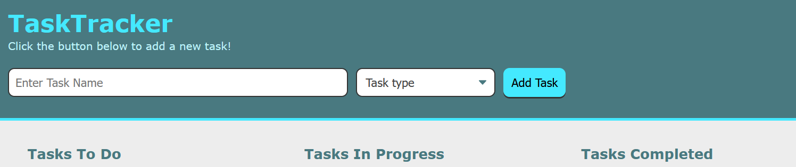

# TaskTracker

## Description

Sort your tasks by setting the status as:
* To Do
* In Progress
* Completed

Tasks can be deleted and edited, and can have their status changed by clicking
on the dropdown menu.

All tasks will be saved after you refresh the page so you don't lose track!

To create a new task, type the task name in the top bar, and select the task
type. Then press "Add Task".

To edit a task, press the "edit" button. The task can be edited in the bar
at the top of the page. You can change the task name, and status, and then save your changes.

TaskTracker is also responsive for mobile devices.

## Made With
* HTML
* CSS
* JavaScript

## Website
https://chance-crawford.github.io/TaskTracker/
